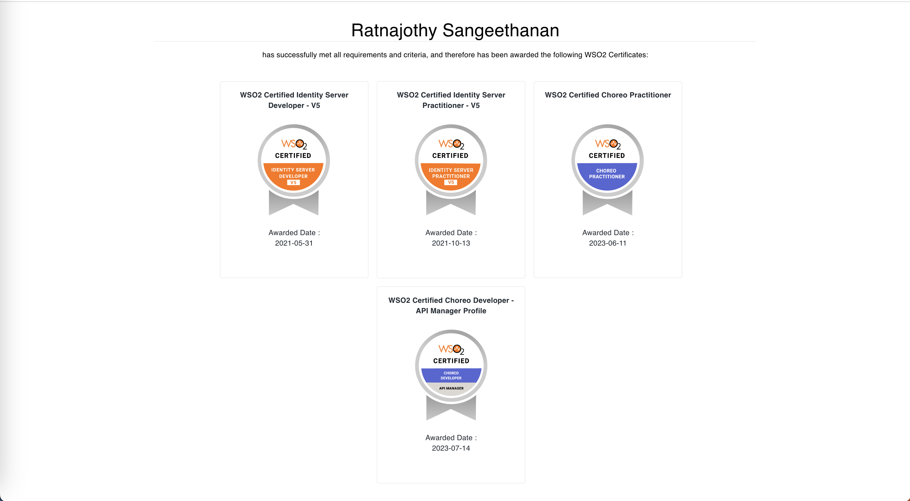

### 👋 Hi there, I'm Ratnajothy Sangeethanan

#### 🚀 About Me
- **Research Enthusiast**: I possess a strong ability for research and analysis, always keen to uncover deep insights in technology.
- **Tech Explorer**: Currently diving deep into the realms of **Identity & Access Management** and **API Management** technologies.
- **Audio Book Aficionado**: A big fan of audio reading 🎧. I love immersing myself in the world of books, especially English translations of Korean novels.
  
#### WSO2 Certifications 🥇
[https://certification.wso2.com/web/certificate/6WS7A6](https://certification.wso2.com/certificate/6WS7A6)
<table border="0" cellspacing="0" cellpadding="0">
<tr>
<td align="middle"></td>
</tr>
</table>

#### 📫 How to reach me:
- **LinkedIn** : [Connect with me on  LinkedIn](https://www.linkedin.com/in/ratnajothy-sangeethanan)
- **Email**: ratnajothy@wso2.com

#### ⚡ Fun fact:
- I find inspiration in the background scores of movies and nostalgic themes from classic anime and cartoons.

---
> Exploring technology, enhancing capabilities, and enjoying the journey of continuous learning!
